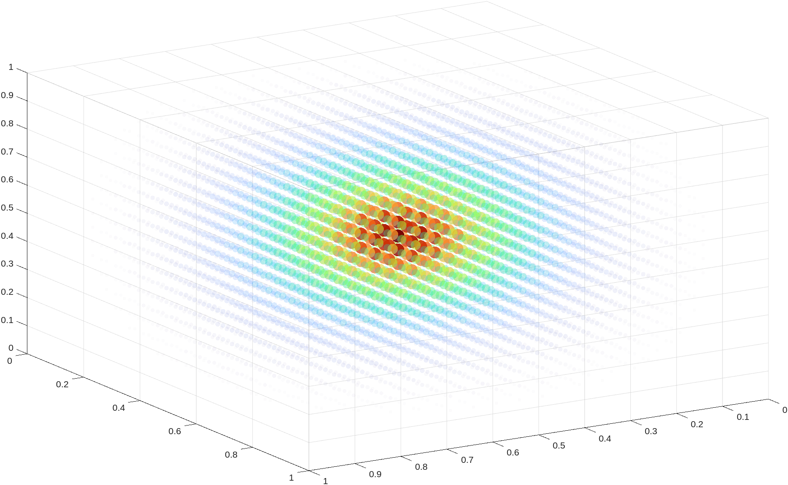

# Neuberger-PDE
Solving a few PDE pretty closely following John M. Neuberger's Differences Matricies for ODE and PDE text.

## WaveEq.m (Wave Equation)
This script solves and plots a little movie of a 1x1 square. There's a few equations in the code to create plots like these: (so pretty!)

## Newtons Method scripts
Using Newtons method to solve what is essentially 